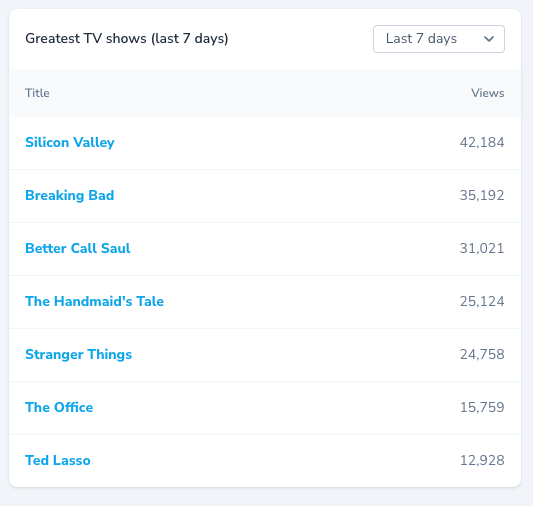
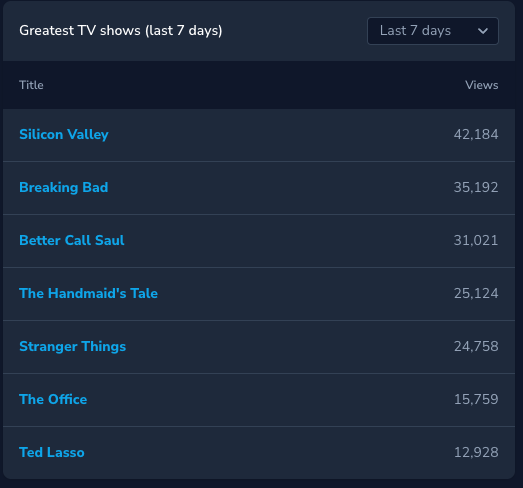

# Laravel Nova Table Metrics

<p align="center">
    
    
</p>

## Installation

```console
composer require ardenthq/nova-table-metrics
```

## Usage

### Creating a Table component

```php
class GreatestShows extends Table
{
    public function title() : string
    {
        return 'Greatest TV shows';
    }

    public function heading() : string
    {
        return 'Title';
    }

    public function detailHeading() : string
    {
        return 'Views';
    }

    public function defaultPeriod() : ?Period
    {
        return Period::Day;
    }

    /**
     * @return Collection<int, TableRow>
     */
    public function items(?Period $period) : Collection
    {
        return collect([
            TableRow::make('Silicon Valley', '42,184')
                    ->url('https://www.youtube.com/watch?v=dQw4w9WgXcQ')
                    ->openInNewTab(),

            //
        ]);
    }
}
```

#### Disable date filters

To disable date filters, override the `hasPeriodSelector` method on the Table component:

```php
class GreatestShows extends Table
{
    public function title() : string
    {
        return 'Greatest TV shows';
    }

    public function heading() : string
    {
        return 'Title';
    }

    public function detailHeading() : string
    {
        return 'Views';
    }

    public function defaultPeriod() : ?Period
    {
        return null;
    }

    /**
     * @return Collection<int, TableRow>
     */
    public function items(?Period $period) : Collection
    {
        return collect([
            TableRow::make('Silicon Valley', '42,184')
                    ->url('https://www.youtube.com/watch?v=dQw4w9WgXcQ')
                    ->openInNewTab(),

            //
        ]);
    }

    public function hasPeriodSelector() : bool
    {
        return false;
    }
}
```

### Registering a Table

In your Nova dashboard, register a table by adding it to the `cards` method:

```php
class Main extends Dashboard
{
    public function name()
    {
        return 'Dashboard';
    }

    public function cards()
    {
        return [
            // ...
            GreatestShows::make()->width('1/3'),
        ];
    }
}

```

## Development

1. Run `yarn nova:install` and `yarn install` to install all the necessary dependencies for compiling the view components
2. Run `yarn run dev` (or `yarn run watch`) while making changes to the components in your local environment
3. If you modify Vue components, ensure to compile for production before making a PR

### Compile for production

1. Run `yarn nova:install` and `yarn install` to install all the necessary dependencies for compiling the view components.
2. Run `yarn run production`.

### Analyze the code with `phpstan`

```bash
composer analyse
```

### Refactor the code with php `rector`

```bash
composer refactor
```

### Format the code with `php-cs-fixer`

```bash
composer format
```

## Security

If you discover a security vulnerability within this package, please send an e-mail to security@ardenthq.com. All security vulnerabilities will be promptly addressed.

## Credits

This project exists thanks to all the people who [contribute](../../contributors).

## License

[MIT](LICENSE) © [ArdentHQ](https://ardenthq.com)
